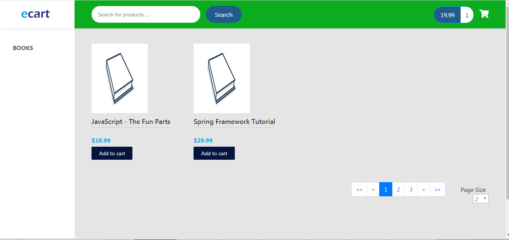

# eCart
Spring Boot - Angular online shopping project 

## Requirement
1)  Jdk 8 [click here](https://www.oracle.com/java/technologies/javase-jdk8-downloads.html)
2)  Nodejs 12 [click here](https://nodejs.org/en/download/)
3)  MySql [click here](https://www.mysql.com/downloads/)

### Run sql script

```
Run create-user-product.sql
```

### Running spring boot

```
mvn install
mvn spring-boot:run
```
This will start backend server

### Running Abgular development server

Run `ng serve` for a dev server. Navigate to `http://localhost:4200/`. The app will automatically reload if you change any of the source files.

### Note
product still in development phase.

### Product Image

